# Asiatech Internship Management System (AIMS) | Site: https://group72024.ceitesystems.com/
A web-based **Internship Management System (IMS)** that automates manual on-the-job training processes, including managing students’ documents, tracking OJT progress, approving or rejecting submissions, archiving users, and evaluating student performance, improving efficiency, accuracy, and overall internship management.


## **Features**
- CRUD (Create, Read, Update, Delete) operations for users and documents
- Secure login using username and password for Students, Coordinators, Deans, Supervisors, Registrar, and Admin
Different dashboards per user type:
  Admin: user and system analytics
  Students: OJT hours progress and pending tasks
  Coordinators: student submissions and OJT hours progress
  Deans: student and coordinator counts
- Searching, sorting, pagination, and filtering in data tables
- User account management (add, edit, delete, archive)
- File upload with drag-and-drop and browse functionality (Excel, PDF, Images)
- File preview with in-app PDF/Image viewing (zoom and page navigation)
- Approval and rejection of submitted files
- Input validation and duplicate record checking
- Secure password hashing and reset support
- Student evaluation and performance tracking

## 📸 Samples
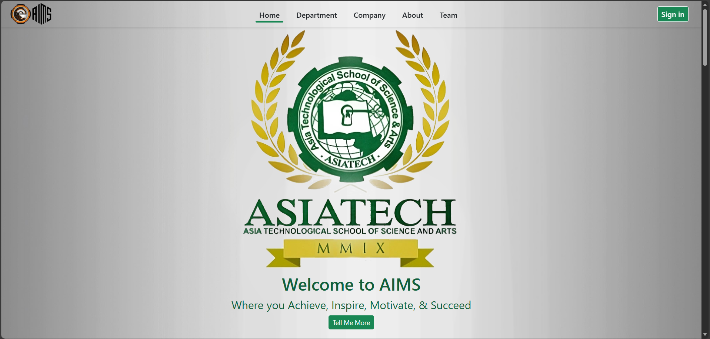
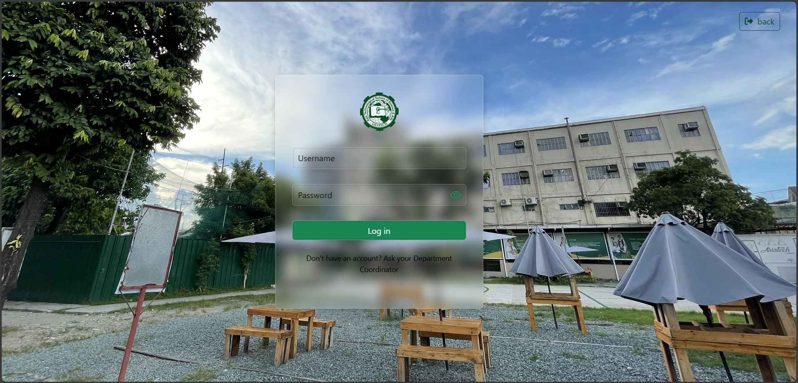
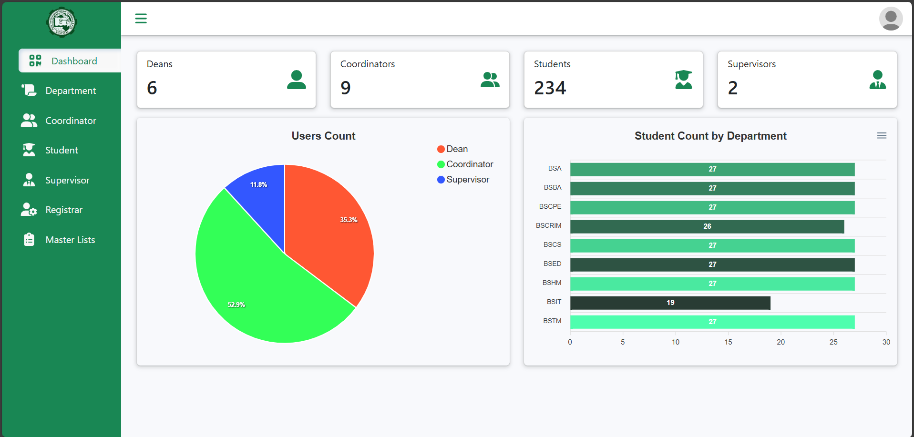
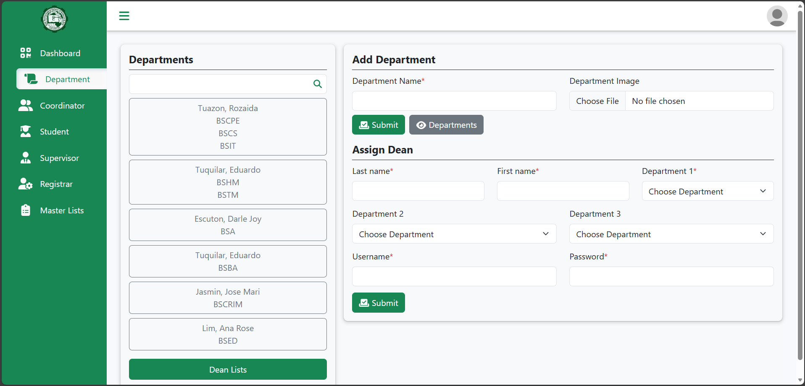
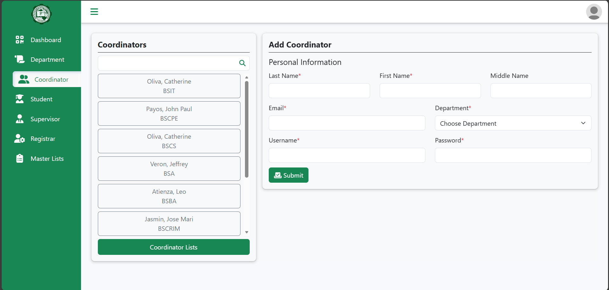
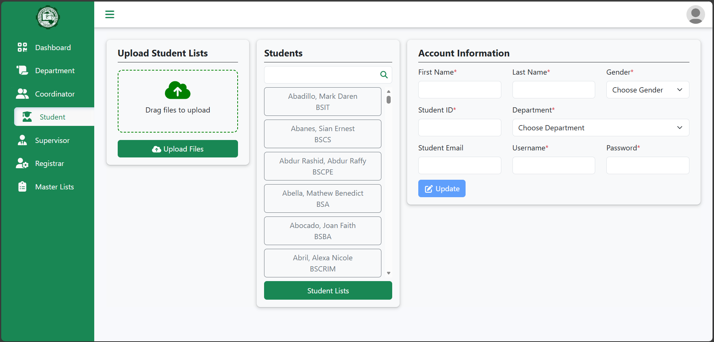
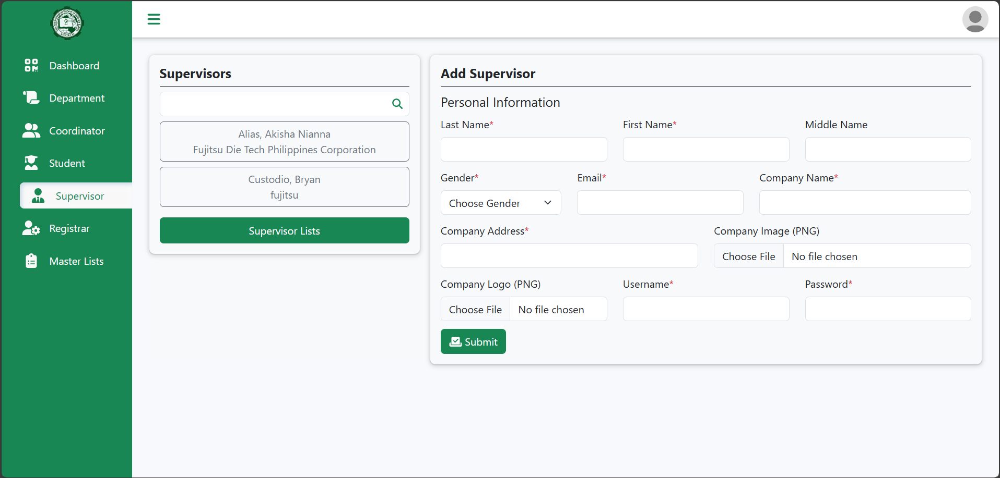
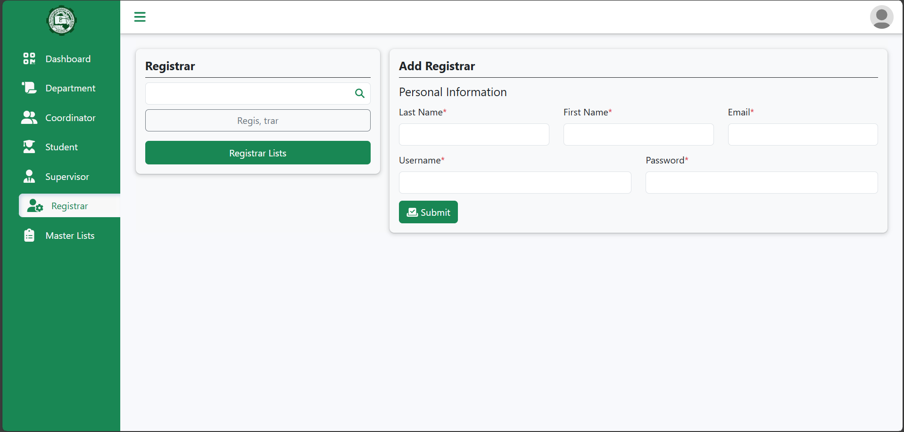
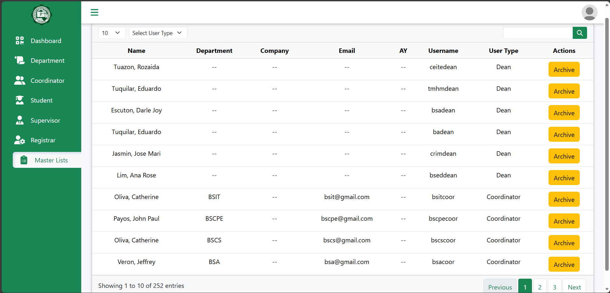
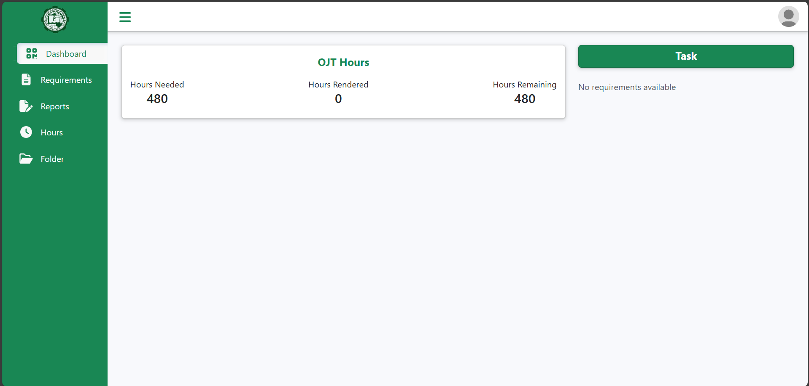
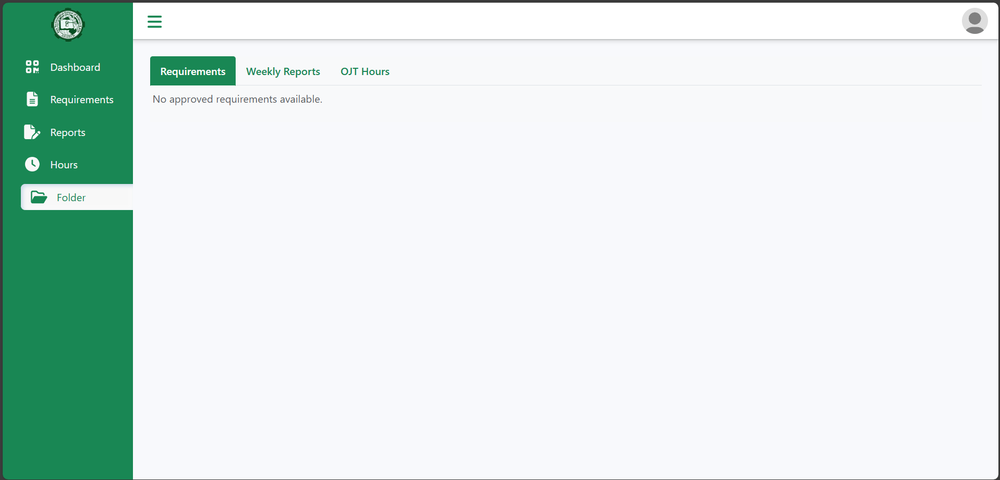
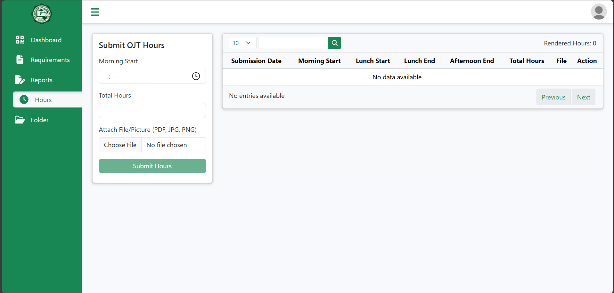
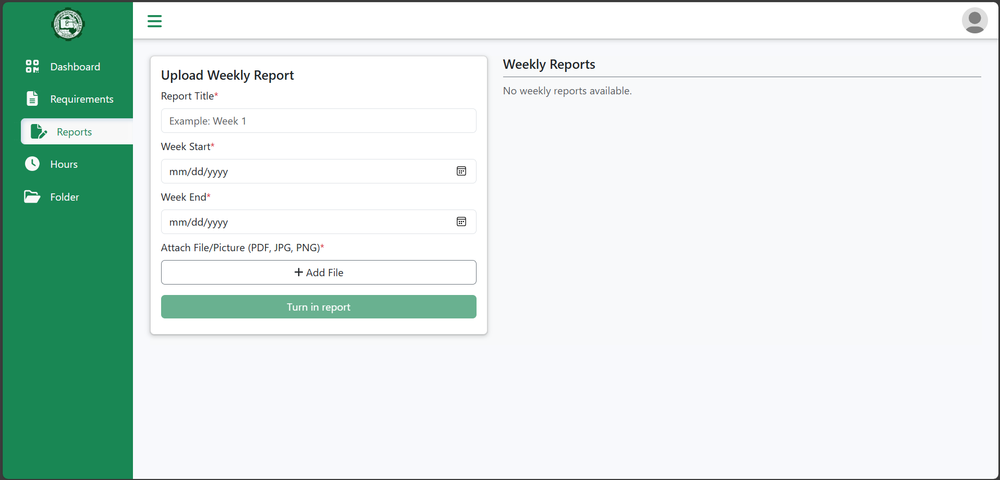
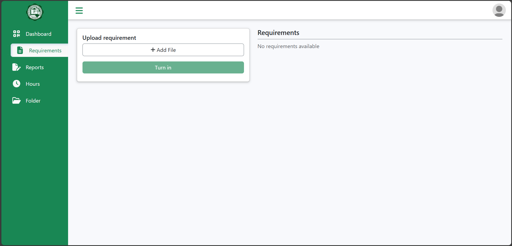
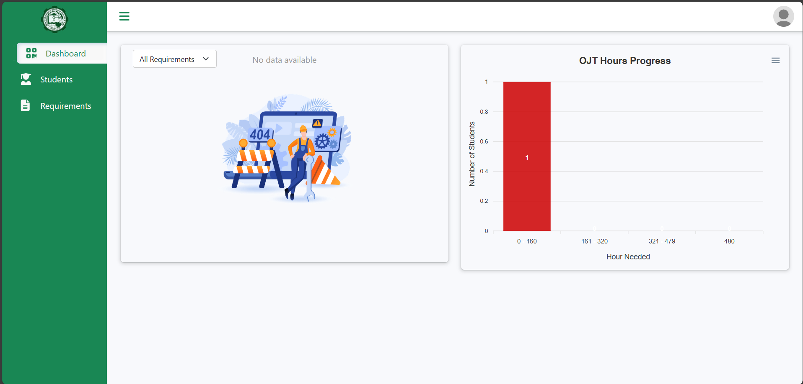
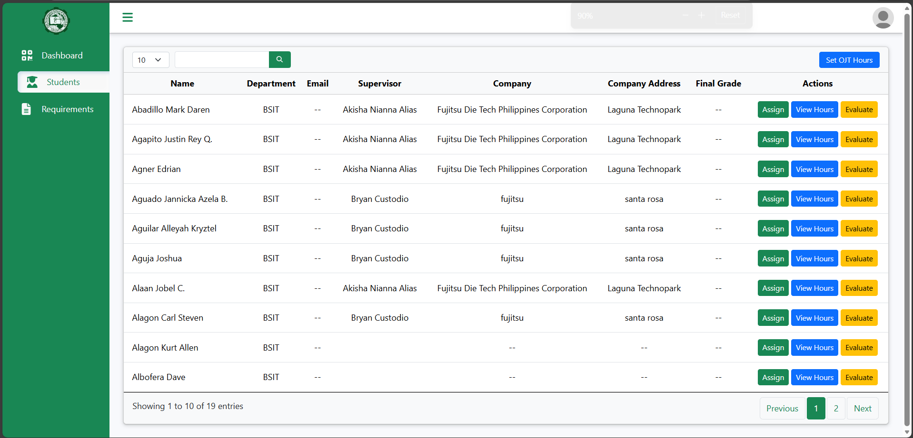
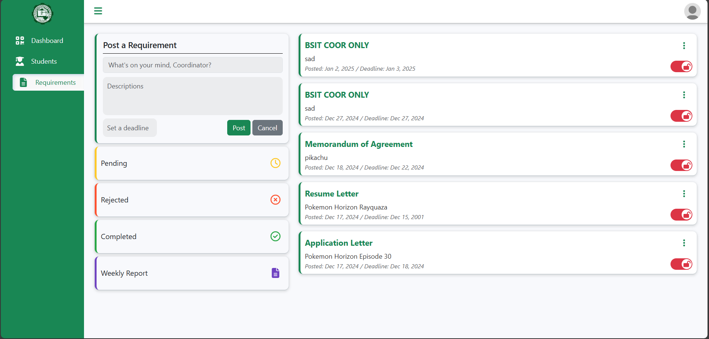
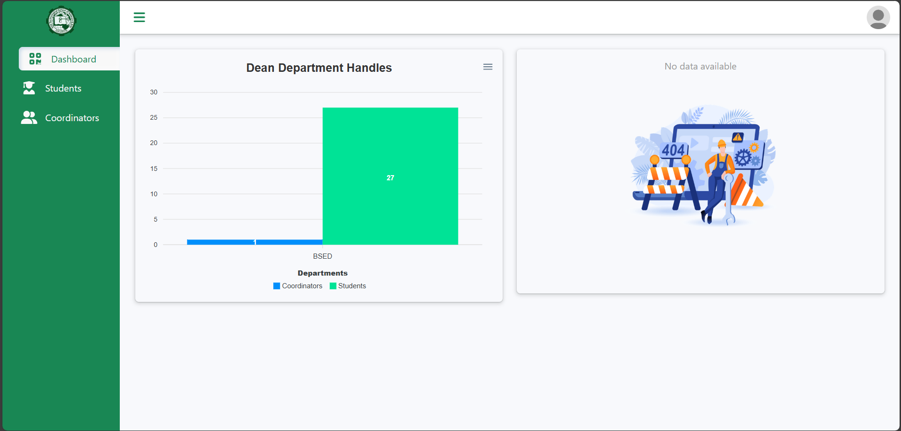
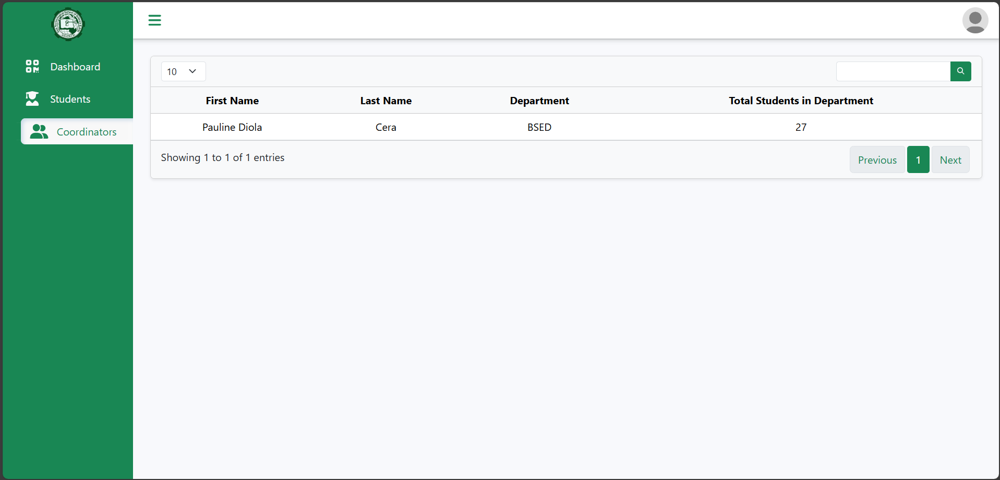
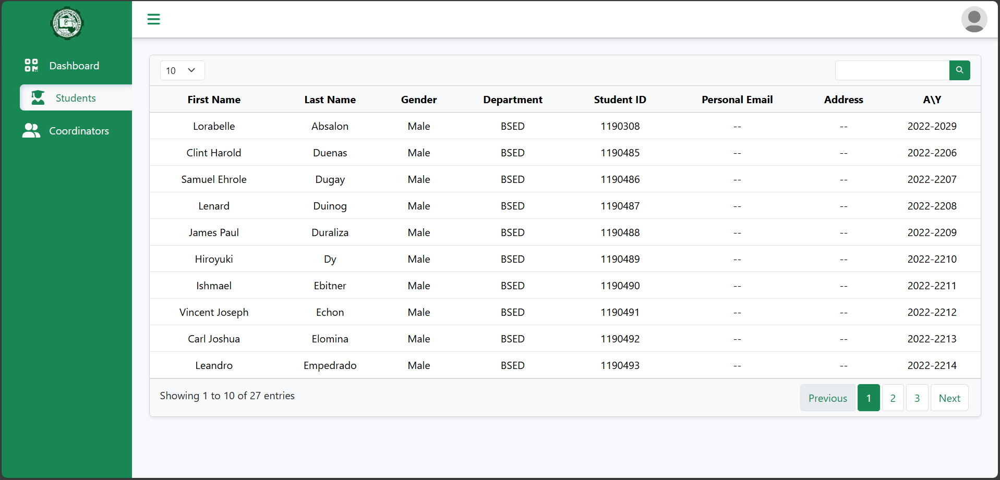
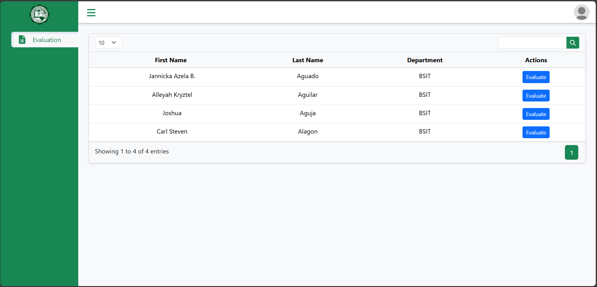

## Tech Stacks
- Frontend: <strong>HTML, CSS, Bootstrap 5, JavaScript JQuery</strong>
- Backend: <strong>PHP</strong>
- Database: <strong>MySQL</strong>
- Tools: <strong>XAMPP, phpMyAdmin</strong>

## Setup
1. Clone this repository:
   ```bash
   git clone https://github.com/AlbertAlias/AIMS.git
2. Move the project folder to htdocs/
3. Run XAMPP's Apache and MySql, then access http://localhost/phpmyadmin/
4. Create database and name it 'aims_db'
5. Import aims_db.sql file inside the database folder
6. Access the system with this url: http://localhost/aims/
    - *Username: itdev*
    - *Default password: itdev*
  
## Author
👨‍💻 **Albert D. Alias**<br/>
👨‍💻 **Bryan G. Custodio**<br/>
📫 Email: albert10.aa.aa@gmail.com<br/>
🐙 GitHub: [@AlbertAlias](https://github.com/AlbertAlias)

> #### 📢 Disclaimer
> This project is shared publicly for **demonstration and portfolio purposes only**.  
> Please **do not use or distribute this code for commercial purposes** without prior permission.
>
> The School logo used in this project is for **visual demonstration only**.  
> It is the intellectual property of **[Asia Technological School of Science and Arts](https://www.asiatech.edu.ph/)**.  
> No copyright ownership is claimed.
>
> `© AIMS 2025`
